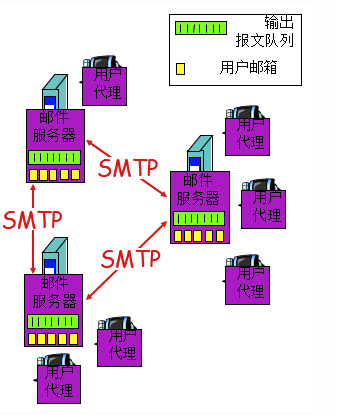
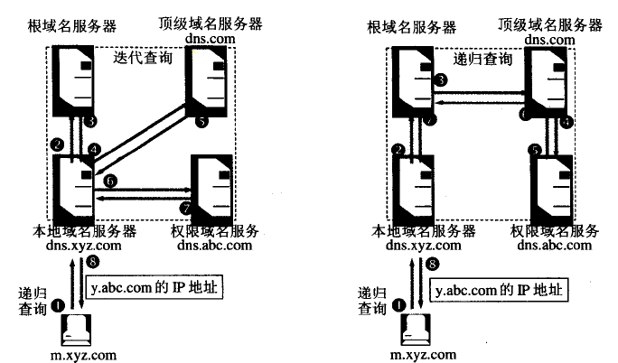
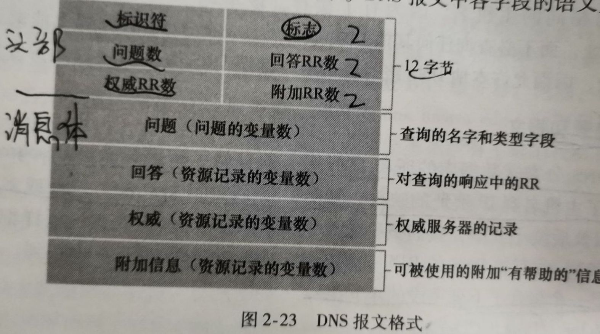

# 应用层无过滤学习

## 一。应用层协议原理

### 1.网络应用是计算机网络存在的理由

- 那么，网络应用程序 的核心是什么？
- 写出能够运行在不同端系统和通过网络彼此通信的程序。
  
- 那么，网应用程序的体系结构是什么样子？
- PS：应用程序的体系结构明显不同于网络体系结构。可从两个方面看：
- （1）应用程序研发者：网络体系结构是固定的，并为应用程序提供了特定的服务集合
- （2）应用程序体系结构由以应用程序研发者设计，规定了如何在各种端系统上组织该应用程序
- 两种主流体系结构：客户-服务器体系结构，对等体系结构（P2P体系结构）
  
- 客户-服务端体系结构
- 定义：有一个总是打开的主机即服务器，服务于许多客户主机的请求。
- 特征：1.客户相互之间不直接通信 2.该服务器具有固定的、周知的地址，即IP地址
- 问题：单独一台服务器主机跟不上所有客户请求
- 解决：创建虚拟服务器 即配置大量主机的数据中心
- 案例：搜索引擎，因特网商务(e-Bay)，基于web的电子邮件(Gmail)，社交网络(脸书)

- 对等体系结构（P2P体系结构）
- 定义：应用程序间断连接的主机对（对等方）之间使用直接通信，而不必通过专门的服务器
- 特性：开放，自扩展性，成本有效
- 问题：1.ISP友好：当下非对称 下载>上载 2.安全性 3.用户自愿提供带宽、存储、计算资源
- 案例：文件共享，对等方协助下载加速器(迅雷)，因特网电话，IPTV

### 2.进程通信

- 引子：多端系统上的程序是如何进行通信的？ 进程，而非程序
- 一个进程可以被认为是运行在【端系统】中的一个程序
- 分类：同端通信，异端通信
- 同端通信：使用【进程间通信机制】相互通信。进程间通信的规则由端系统上端操作系统确定。
- 异端通信：通过跨越计算机网络【交换报文】而相互通信。
- PS：网络应用程序由成对的进程组成，他们通过网络相互发送报文。
- 定义：在给定的一对进程之间的通信会话场景中，发起通信的进程被标识为客户，在会话开始时等待联系的进程是服务器。
- 抽象：进程，套接字，缓冲区
- 类比：房子，门
- 套接字定义：同一台主机内应用层与传输层之间的接口
- 进程寻址：标识接收进程需定义两种信息：1.主机地址2.接收进程标识符，即端口号

### 3.传输服务

- 传输层协议为应用程序提供的服务？可靠数据传输、吞吐量、定时、安全性
- （1）可靠数据传输：发送进程只要将数据传递进嵌套子，该数据就能无差错到达接收进程
- （2）吞吐量：可用吞吐量：发送进程能够向接收进程交付比特的速率。
- 带宽敏感应用：视频，音频；   弹性应用：电子邮件，文件传输，web传送
- （3）定时：要求数据交付有严格的时间限制
- （4）安全性：在发送和接收进程之间提供机密性，即加密解密
- 因特网提供的运输服务：TCP,UDP（二者均未提供加密机制->TCP加强版：安全套接字层SSL）
- ｜ 强化在应用层实现：发送进程 数据 -> SSL套接字（加密）-> TCP套接字
- TCP：面向连接，可靠的数据传送服务，拥塞控制（当发送方和接收方之间的网络出现拥塞时，TCP的拥塞控制机制会抑制发送进程）
- UDP：无连接，不可靠的数据传送服务，任意速率发送
- 因特网传输协议不提供的服务：吞吐量，定时

### 4.应用层协议

- 定义：运行在不同端系统上的应用进程如何相互传递报文
- web的应用层协议HTTP
- 电子邮件的主要应用层协议SMTP

## 二。Web和HTTP

### 1.HTTP概况

- HTTP是无状态协议，因HTTP服务器不保存关于客户的任何信息
- HTTP既可选择非持续连接，也可选择持续连接（默认方式）
- ｜      非持续连接：每个响应对经过一个单独的TCP连接发送
- ｜      持续连接：所有的请求及其响应经过相同的TCP连接发送
- PS：在默认方式下，大部分浏览器打开5-10个并行的TCP连接，每条连接处理一个请求响应事务。
- 往返时间（RTT）：一个短分组从客户到服务器，再返回客户所花费的时间。
- 持续连接缺点：1.需要为每个请求对象建立和维护新连接。在客户和服务器建立TCP缓冲区和TCP变量。服务器负担重。
- ｜          2. 每一个对象经受两倍RTT的交付时延

### 2.HTTP报文格式

- 分类：请求报文，响应报文
- 请求报文（4部分）：请求行（方法字段，URL字段，HTTP版本字段），首部行（Host,Connection,User-agent,Accept-language），空行，实体主体
- 详解：Host: 对象的主机。该信息是Web代理高速缓存所要求的。
- ｜   Connection: 值为close，则不使用持续连接。
- ｜   User-agent: 指明用户代理，即向服务器发送请求的浏览器类型。服务器为不同浏览器发送相同对象的不同版本。
- ｜       《webkit技术内幕》 -> 用户代理字符串  目的：更好的用户体验
- ｜   Accept-language: 用户想得到该对象的语言版本。
- 响应报文（3部分）：初始状态行（协议版本字段，状态码，相应状态信息），6个首部行，实体主体
- 6个首部行：Connection: 值为close，则不使用持续连接。
- ｜        Date: 服务器产生并发送该响应报文的日期和时间。该值一般是服务器从其文件系统中检索到该对象，插入到响应报文，并发送该响应报文的时间
- ｜        Server: 响应的服务器类型。
- ｜        Last-Modified: 对象创建或最后修改的日期。
- ｜        Content-Length: 被发送对象的字节数。
- ｜        Content-type: 实体体中的对象类型

### 3.用户与服务器的交互：cookie

- 引子：HTTP是无状态的，那web站点是如何识别用户的？HTTP使用cookie，允许站点对用户进行追踪。
- cookie（4个组件）：1.HTTP请求报文中 cookie首部行 2.HTTP响应报文中 cookie首部行
- ｜                3.用户端系统保留一个cookie文件，由浏览器进行管理
- ｜                4.位于Web站点的一个后端数据库
- 结论：cookie可以用于标识一个用户。cookie在无状态HTTP之上建立了一个用户会话层。

### 4.Web缓存

- Web缓存器（代理服务器）：代表初始Web服务器来满足HTTP请求的网络实体。
- 诞生原因（好处）：1.减少对客户请求的响应时间 2.整体上降低因特网的web流量，改善所有应用的性能
- CDN（内容分发网络）
- 每次都拿到缓存，可能引入一个问题，缓存器中的对象副本可能是陈旧的。如何解决？条件GET。
  
### 5.条件GET方法

- 前言：HTTP协议的一种机制，允许缓存器证明他的对象是最新的。即条件GET方法。
- 要求：1.请求报文使用GET方法  2.首部行包含If-Modified-Since

## 三。文件传输协议：FTP

- HTTP和FTP都是文件传输协议。区别：FTP使用两个并行的TCP连接来发送文件。
- 控制连接：在两主机之间传输控制信息。客户与服务器21号端口。FTP命令是7比特在此传送。
- 数据连接：实际发送一个文件
- 结论：FTP控制连接贯穿了整个用户会话期间，但会话中的每一次文件传输都会建立一个新的数据连接。
- FTP服务器必须在整个会话期间保留用户的状态 => 对每个进行中的用户会话状态进行追踪 => 限制了同时维持的会话总数

### （1）常见FTP命令
  
- USER username: 传送用户标识
- PASS password: 发送用户口令
- LIST: 当前远程目录中所有文件列表
- RETR filename: 从当前目录检索文件
- STOP filename: 在当前目录存放文件 

### （2）常见FTP响应

- 331: 用户名OK，需要口令
- 125: 数据连接已打开，开始传送
- 425: 无法打开数据连接
- 452: 写文件差错

## 四。因特网中的电子邮件

- 电子邮件系统构成： 用户代理，邮件服务器，简单邮件传输协议
- 因特网电子邮件体系结构的描述 如下图：

- SMTP是因特网电子邮件中主要的应用层协议。它使用TCP可靠数据传输协议。

### 1.SMTP与HTTP的对比

- 前言：当进行文件传输时，HTTP和SMTP都使用持续连接。
- 三个区别：
- 1.HTTP是一个拉协议(pull protocol)，SMTP是一个推协议(push protocol)
- 2.格式限制：HTTP无限制；SMTP要求每个报文使用7比特ASCII码格式
- 3.如何处理 文本+图片(或其他媒体类型) 的文档： HTTP把每个对象封装到对应的响应报文中；SMTP把所有对象封装到一个报文中。

### 2.POP3（第三版的邮局协议）

- 工作的三个阶段：特许、事务处理、更新
- 特许：用户代理以明文形式发送用户名和口令以鉴别用户
- 事务处理：用户代理取回报文。可进行 做删除标记、查看信息。
- 更新：在客户发出quit后，结束该POP3会话，删除 被标记为删除的邮件。
  
### 3.IMAP（因特网邮件访问协议）

- 引子：POP3 只能在本地主机操作邮件，如果我想多台机器都可以远程操作，怎么办？IMAP。
- IMAP服务器把每个报文与一个文件夹联系起来。故IMAP服务器维护了IMAP会话的用户状态信息，而POP3没有。
- IMAP具有允许用户代理获取报文组件的命令。例如：只读取一个报文的首部。
- ｜     当用户代理和其他邮件服务器之间使用低宽带连接的时候，这个特性非常有用。

### 4.基于web的电子邮件

- 发件人的浏览器 到 发件人的邮件服务器 使用HTTP
- 发件人的邮件服务器 与 其他的邮件服务器 之间使用SMTP

## 五。DNS：因特网的目录服务

- 识别主机方式：主机名，IP地址
- IP出现原因：主机名没有提供关于主机在因特网中位置的信息，且不定长的字母数字对于路由器难以处理，故诞生IP地址
- DNS诞生原因：我们需要一种能进行主机名到IP地址转换的目录服务，即DNS（域名系统）
- DNS定义：1.一个由分层的DNS服务器实现的分布式数据库
- ｜      2.一个使得主机能够查询分布式数据库的应用层协议
- 本质：DNS服务器通常是运行BIND软件上的UNIX机器。
- 扩展：DNS协议运行在UDP之上，使用53端口号。
  
### 1.DNS提供的服务

- （1）主机名到IP地址的转换
- （2）主机别名
- （3）邮件服务器别名
- （4）负载均衡：一个IP地址集合与同一个规范主机名想联系。

### 2.DNS工作机理 演变

- 集中式设计：只是用一个DNS服务器。设计简单。
- 缺点：（1）单点故障：该DNS服务器崩溃，整个因特网瘫痪。
- ｜   （2）通信容量：单个DNS服务器处理所有DNS查询
- ｜   （3）远距离的集中式数据库： 可能会导致严重时延。
- ｜   （4）维护：为所有因特网主机保留记录。中央数据库非常庞大。
  
- 分布式、层次数据库：使用大量DNS服务器，以层次方式组织，分布在全世界。
- 3种类型DNS服务器：根DNS服务器，顶级域名DNS服务器（TLD），权威DNS服务器
- 严格来说，本地DNS服务器不属于该服务器的层次结构，但它对于DNS层次结构很重要。
- DNS查询：请求主机到本地DNS服务器是递归，后面的查询既可以迭代（实际采用迭代），也可以递归。

- 为了改善时延性能并减少在因特网上到处传输的DNS报文数量，引入了DNS缓存。
- DNS缓存原理：在一个请求链中，当某DNS服务器接收一个DNS回答时，它能够将该回答中的信息缓存在本地存储器中。
- 因主机名和IP映射不是永久的，故DNS服务器通常在两天后将丢弃缓存信息。
  
### 3.DNS记录和报文

- 资源记录(RR): 提供了主机名到IP地址的映射。
- 每个DNS回答报文包含了一条或多条资源记录。
- 资源记录结构： 4元组 (Name, Value, Type, TTL)
- TTL是该记录的生存时间，决定了资源记录从缓存中删除的时间。
- Name和Value的值取决于Type
- DNS报文只有两种：查询，回答。两者具有相同的格式。

- 

