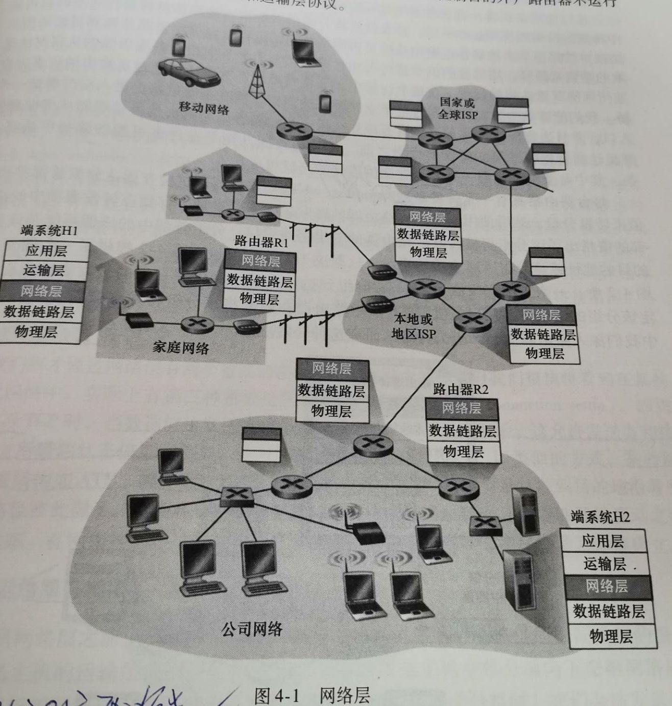
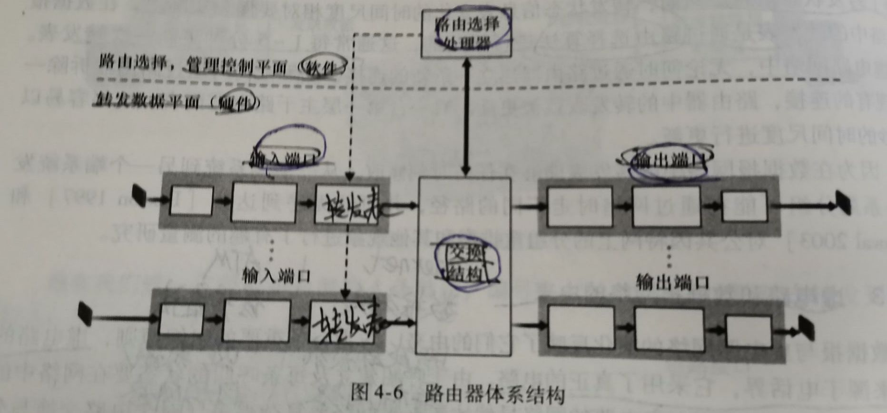
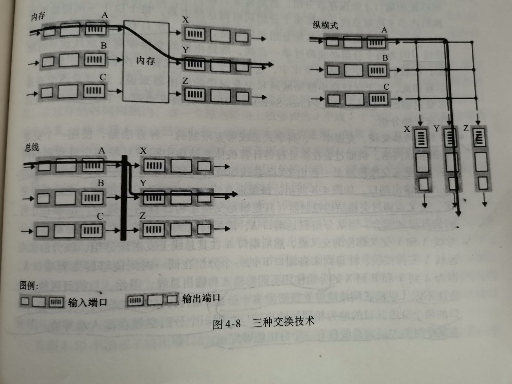
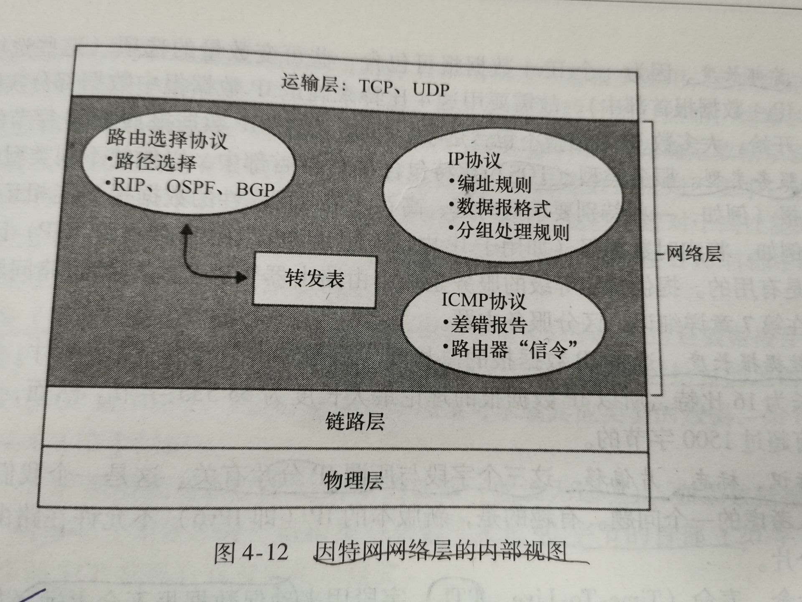
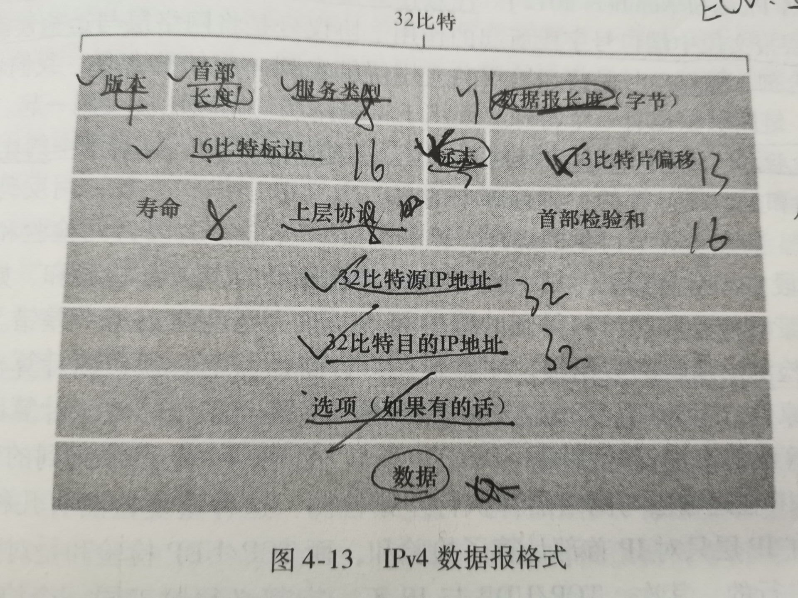

# 网络层无过滤学习

## 一。概述

- 网络层 如下图：

- 路由器作用：将数据报从入链路转发到出链路
- 路由器不运行应用层和传输层协议

- 网络层的功能：转发，路由选择，连接建立
- ｜    转发：当一个分组到达路由器当一条输入链路时，路由器必须将该分组移动到适当的输出链路。
- ｜    路由选择：当分组从发送方流向接收方时，网络层必须决定这些分组所采用的路由或路径。计算这些路径的算法被成为路由选择算法。
- ｜    连接建立：
- ｜PS：转发是路由器本地动作，路由选择是指网络过程的范围。
- 如何转发？路由器根据分组首部字段的值，在其转发表中索引查询，找到输出链路接口。
- 转发涉及到分组交换机，分组交换机（2类）：链路层分组交换机，路由器。
- ｜    链路层分组交换机：基于【链路层】字段中的值做转发决定。
- ｜    路由器：基于【网络层】字段中的值做转发决定。
- 网络服务模型：定义了分组在发送与接收端系统之间的端到端运输特性。
- 网络服务模型类别：尽力而为服务（best-effort service），ATM网络服务 等等
- （理想） 网络层提供的特定服务：确保交付、具有时延上界的确保交付、有序分组交付、确保最小带宽、确保最大时延抖动、安全性服务
  
### 1.虚电路和数据报网络

- 前言：他们是计算机网络的两种基本类型。
- 虚电路网络：仅在网络层提供【连接】服务的计算机网络，如ATM
- 数据报网络：仅在网络层提供【无连接】服务的计算机网络
- 区别：在作出转发决定时，使用不同信息。前者需要路由器维护连接状态信息，后者不需要。
- PS：后者会维护转发表中的 转发状态信息。通常每1-5分钟奉新一次转发表。其更新是根据路由选择算法修改的。

- 一条虚电路组成：1.源和目的主机之间的路径 2.VC号(每条链路都有一个号码，跟转发表同表) 3.转发表表项
- 虚电路的三个阶段：虚电路建立、数据传送、虚电路拆除
- **网络层的虚电路建立 与 传输层的连接建立 区别：前者涉及两个端系统及其 之间路径上的路由器，每台路由器都完全知道经过他的所有虚电路；后者仅涉及两个端系统，端系统决定连接参数，路由器不知情。
  
- 数据报网络： 路由器转发表：目的地址 映射 链路接口
- 路由器使用最长前缀匹配规则。

### 2.历史

- 虚电路的概念来源于电话界，它采用了真正的电路。
- 因特网作为一种数据报网络，是由将计算机连接在一起的需求发展而来的。由于端系统设备复杂的多，因特网架构师们选择使网络层服务模型尽可能简单。

## 二。转发

### 1.路由器工作原理

- 路由器体系结构，如下图(4个组成部分)：输入端口，输出端口，交换结构，路由选择处理器

- 输入端口：转发表由路由选择处理器计算和更新的，但转发表的一份影子副本通常被存放在每个输入端口。避免了集中式处理的瓶颈。（线路端接，数据链路处理，查找转发排队）
- 交换结构：功能为交换（转发）。可通过三种技术实现：1.经内存交换（串行发送分组） 2.经网络交换（串行发送分组） 3.经互联网交换（并行发送分组）

- 输出端口：（排队[缓存管理]，数据链路处理，线路链接）
- 那些因素会影响排队(位置和程度)呢？流量负载，交换结构的相对速率，线路速率
- 引发问题：排队的增长，路由器缓存空间耗尽，出现丢包。[丢包：在网络中丢失，被路由器丢弃]
- 缓存空间应该多大？B=RTT*C/根号N
- RTT：平均往返时延, C：链路的容量, N：TCP流
- 丢包策略：弃尾（丢弃到达分组），删除已排队分组为新到分组腾出空间。统称为主动队列管理算法（AQM）。在AOM中，随机早期检测算法（RED）得到广泛研究。
  
### 2.网际协议：因特网中的转发和编址

- 前言：因特网编址和转发是网际协议（IP）的重要组件。
- 因特网的网络层主要有三个重要组件：IP协议，路由选择，因特网控制报文协议（ICMP）

 

- IPV4数据报格式, 如下：首部40字节

 

- IP数据报分片：
- 最大传输单元（MTU）：一个链路层帧能承载的最大数据量(这里是数据，数据不包含首部)
- 为了坚持 网络内核保持简单 原则，数据报的重新组装工作放到端系统中，而不是在路由器中。
- 目的主机如何组装分片呢？将标识(序号++)、标志(尾0，其余1)和片偏移字段放在IP数据报首部中。
- IPV4分片的坏处：1.使路由器和端系统更为复杂 2.分片能够被用于生成致命的Dos攻击，由此攻击者发送了一系列古怪的、无法预期的片。比如，发送小片流，无偏移量为0的片。 3.发送交迭的IP片，即这些片的偏移量值被设置得不能够适当的排列起来。
- 分片问题解决方案：IPV6

 

- IPV4编址：
- PS：每个IP地址长度32位
- 因特网的地址分配策略被称为无类别域间路由选择（CIDR）
- 
